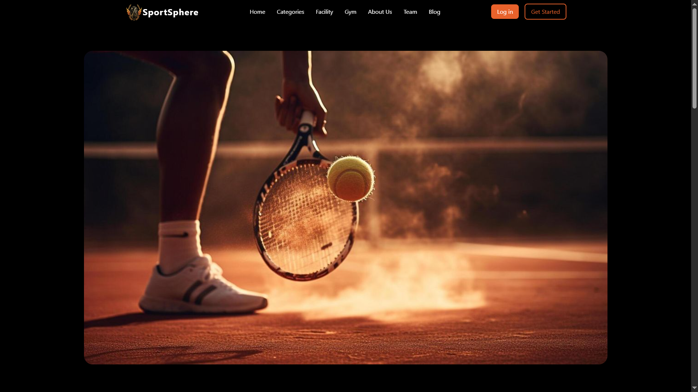
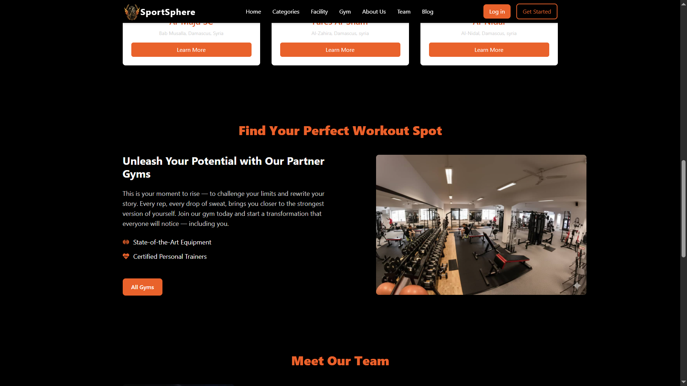
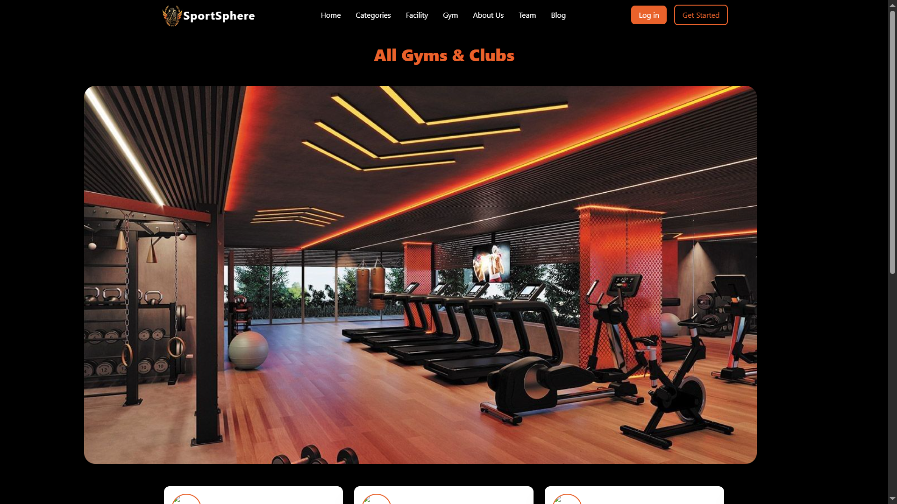
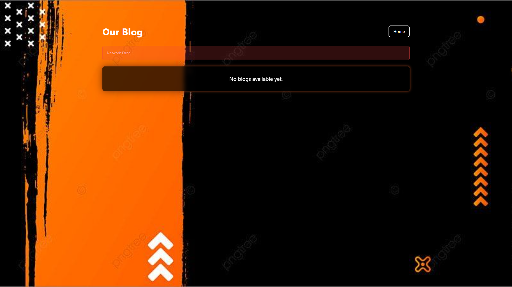

# 🏟️ Sports Facility Management System
The Sports Facility Management System is a comprehensive web application designed to manage sports facilities, including stadiums, gyms, and other sports-related venues. The system provides a user-friendly interface for administrators to manage facilities, coaches, and users, while also offering a seamless experience for users to book facilities and access relevant information.






## 🚀 Features
* User registration and authentication
* Facility management (stadiums, gyms, etc.)
* Coach management
* Booking system for facilities
* User profile management
* Admin dashboard for overall system management
* Route guards for authentication and authorization

## 🛠️ Tech Stack
* Frontend: React, React Router, Tailwind CSS, Axios
* Backend: Node.js, Express.js, MongoDB, Mongoose
* Authentication: JSON Web Tokens (JWT)
* Deployment: Vite

## 📦 Installation
To install the project, follow these steps:
1. Clone the repository using `git clone`
2. Install dependencies using `npm install` or `yarn install`
3. Start the development server using `npm run dev` or `yarn dev`

## 💻 Usage
1. Start the development server
2. Open a web browser and navigate to `http://localhost:3000`
3. Register as a user or login with existing credentials
4. Explore the application and its features

## 📂 Project Structure
```
Sport_managment_System
├─ .DS_Store
├─ Backend
│  ├─ controllers
│  │  ├─ auth.controller.js
│  │  ├─ blog.controller.js
│  │  ├─ book.controller.js
│  │  ├─ category.controller.js
│  │  ├─ comment.controller.js
│  │  ├─ session.controller.js
│  │  ├─ stadium.controller.js
│  │  └─ user.controller.js
│  ├─ database
│  │  └─ connectdb.js
│  ├─ middleware
│  │  ├─ auth.middleware.js
│  │  ├─ role.middleware.js
│  │  └─ uploadImage.js
│  ├─ models
│  │  ├─ blog.model.js
│  │  ├─ Book.model.js
│  │  ├─ category.model.js
│  │  ├─ comment.model.js
│  │  ├─ notification.model.js
│  │  ├─ payment.model.js
│  │  ├─ Stadium.model.js
│  │  ├─ TrainingSession.model.js
│  │  └─ user.model.js
│  ├─ package-lock.json
│  ├─ package.json
│  ├─ routes
│  │  ├─ auth.route.js
│  │  ├─ blog.route.js
│  │  ├─ book.route.js
│  │  ├─ category.route.js
│  │  ├─ comment.route.js
│  │  ├─ session.route.js
│  │  ├─ stadium.route.js
│  │  └─ user.route.js
│  ├─ server.js
│  └─ uploads
│     ├─ 1764676864149-pexels-pixabay-47730.jpg
│     ├─ 1764677250468-pexels-pixabay-47730.jpg
│     ├─ 1764677265728-autn.jpeg
│     ├─ 1764677377446-basketball-7121617_1280.jpg
│     ├─ 1764677412496-images.jpeg
│     ├─ 1764679150030-basketball-7121617_1280.jpg
│     └─ 1764754007200-autn.jpeg
├─ Dashboard
│  ├─ eslint.config.js
│  ├─ index.html
│  ├─ package-lock.json
│  ├─ package.json
│  ├─ public
│  │  └─ vite.svg
│  ├─ README.md
│  ├─ src
│  │  ├─ App.css
│  │  ├─ App.jsx
│  │  ├─ assets
│  │  │  └─ react.svg
│  │  ├─ components
│  │  │  ├─ Layout
│  │  │  │  ├─ AdminLayout.jsx
│  │  │  │  ├─ Sidebar.jsx
│  │  │  │  └─ TopBar.jsx
│  │  │  ├─ Pages
│  │  │  │  ├─ Category.jsx
│  │  │  │  ├─ Coaches.jsx
│  │  │  │  ├─ Login.jsx
│  │  │  │  ├─ Notifications.jsx
│  │  │  │  ├─ Requests.jsx
│  │  │  │  ├─ Stadium.jsx
│  │  │  │  ├─ TrainingSession.jsx
│  │  │  │  └─ User.jsx
│  │  │  └─ Shared
│  │  │     └─ NavItem.jsx
│  │  ├─ index.css
│  │  └─ main.jsx
│  └─ vite.config.js
├─ Frontend
│  ├─ environment
│  │  └─ environment.js
│  ├─ eslint.config.js
│  ├─ index.html
│  ├─ package-lock.json
│  ├─ package.json
│  ├─ public
│  │  ├─ vite.svg
│  │  └─ WhatsApp_Image_2025-12-02_at_12.46.28_PM-removebg-preview.png
│  ├─ README.md
│  ├─ src
│  │  ├─ App.css
│  │  ├─ App.jsx
│  │  ├─ assets
│  │  │  ├─ bg1.jpeg
│  │  │  ├─ bg2.jpeg
│  │  │  ├─ img
│  │  │  │  ├─ bg.jpg
│  │  │  │  └─ bg2.png
│  │  │  └─ react.svg
│  │  ├─ components
│  │  │  ├─ AboutUs.jsx
│  │  │  ├─ ActivityCard.jsx
│  │  │  ├─ Categories.jsx
│  │  │  ├─ CategoryList.jsx
│  │  │  ├─ Facilities.jsx
│  │  │  ├─ facilityData.js
│  │  │  ├─ FacilityDetailsContent.jsx
│  │  │  ├─ FacilityHub.jsx
│  │  │  ├─ Footer.jsx
│  │  │  ├─ GymSection.jsx
│  │  │  ├─ GymSlider.jsx
│  │  │  ├─ HeroSection.jsx
│  │  │  ├─ Icons.js
│  │  │  ├─ Navbar.jsx
│  │  │  └─ TeamSection.jsx
│  │  ├─ environment
│  │  │  └─ config.js
│  │  ├─ img
│  │  │  ├─ 37d24631f51ab8ec28a62ff9af0449ab.jpg
│  │  │  ├─ 412f710e5a277e84ab8d60a513ab9a9d.jpg
│  │  │  ├─ 81a0ce68693374d54ba222b12a705285.jpg
│  │  │  ├─ Gemini_Generated_Image_hpxy6mhpxy6mhpxy.png
│  │  │  ├─ Gemini_Generated_Image_lb9p46lb9p46lb9p.png
│  │  │  ├─ Gemini_Generated_Image_s3ua16s3ua16s3ua.png
│  │  │  ├─ Gemini_Generated_Image_y2guv1y2guv1y2gu (1).png
│  │  │  ├─ images (3).jpg
│  │  │  ├─ img8.jpg
│  │  │  ├─ WhatsApp Image 2025-12-01 at 11.38.05 AM.jpeg
│  │  │  ├─ WhatsApp Image 2025-12-01 at 12.08.33 PM (1).jpeg
│  │  │  ├─ WhatsApp Image 2025-12-01 at 12.08.33 PM.jpeg
│  │  │  ├─ WhatsApp Image 2025-12-01 at 12.08.34 PM.jpeg
│  │  │  ├─ WhatsApp Image 2025-12-01 at 12.25.23 PM.jpeg
│  │  │  ├─ WhatsApp Image 2025-12-02 at 10.31.42 AM.jpeg
│  │  │  ├─ WhatsApp_Image_2025-12-02_at_12.46.28_PM-removebg-preview.png
│  │  │  └─ wowww.jpg
│  │  ├─ index.css
│  │  ├─ main.jsx
│  │  ├─ pages
│  │  │  ├─ Blog.jsx
│  │  │  ├─ CategoryPage.jsx
│  │  │  ├─ CreatePost.jsx
│  │  │  ├─ EstablishmentDetailsPage.jsx
│  │  │  ├─ FacilityDetailsPage.jsx
│  │  │  ├─ GymsPage.jsx
│  │  │  ├─ HomeBage.jsx
│  │  │  ├─ Login.jsx
│  │  │  ├─ Profile.jsx
│  │  │  ├─ Register.jsx
│  │  │  └─ Reservation.jsx
│  │  └─ utils
│  │     └─ api.js
│  └─ vite.config.js
└─ README.md

```
```
Sport_managment_System
├─ .DS_Store
├─ Backend
│  ├─ controllers
│  │  ├─ auth.controller.js
│  │  ├─ blog.controller.js
│  │  ├─ book.controller.js
│  │  ├─ category.controller.js
│  │  ├─ comment.controller.js
│  │  ├─ session.controller.js
│  │  ├─ stadium.controller.js
│  │  └─ user.controller.js
│  ├─ database
│  │  └─ connectdb.js
│  ├─ middleware
│  │  ├─ auth.middleware.js
│  │  ├─ role.middleware.js
│  │  └─ uploadImage.js
│  ├─ models
│  │  ├─ blog.model.js
│  │  ├─ Book.model.js
│  │  ├─ category.model.js
│  │  ├─ comment.model.js
│  │  ├─ notification.model.js
│  │  ├─ payment.model.js
│  │  ├─ Stadium.model.js
│  │  ├─ TrainingSession.model.js
│  │  └─ user.model.js
│  ├─ package-lock.json
│  ├─ package.json
│  ├─ routes
│  │  ├─ auth.route.js
│  │  ├─ blog.route.js
│  │  ├─ book.route.js
│  │  ├─ category.route.js
│  │  ├─ comment.route.js
│  │  ├─ session.route.js
│  │  ├─ stadium.route.js
│  │  └─ user.route.js
│  ├─ server.js
│  └─ uploads
│     ├─ 1764676864149-pexels-pixabay-47730.jpg
│     ├─ 1764677250468-pexels-pixabay-47730.jpg
│     ├─ 1764677265728-autn.jpeg
│     ├─ 1764677377446-basketball-7121617_1280.jpg
│     ├─ 1764677412496-images.jpeg
│     ├─ 1764679150030-basketball-7121617_1280.jpg
│     └─ 1764754007200-autn.jpeg
├─ Dashboard
│  ├─ eslint.config.js
│  ├─ index.html
│  ├─ package-lock.json
│  ├─ package.json
│  ├─ public
│  │  └─ vite.svg
│  ├─ README.md
│  ├─ src
│  │  ├─ App.css
│  │  ├─ App.jsx
│  │  ├─ assets
│  │  │  └─ react.svg
│  │  ├─ components
│  │  │  ├─ Layout
│  │  │  │  ├─ AdminLayout.jsx
│  │  │  │  ├─ Sidebar.jsx
│  │  │  │  └─ TopBar.jsx
│  │  │  ├─ Pages
│  │  │  │  ├─ Category.jsx
│  │  │  │  ├─ Coaches.jsx
│  │  │  │  ├─ Login.jsx
│  │  │  │  ├─ Notifications.jsx
│  │  │  │  ├─ Requests.jsx
│  │  │  │  ├─ Stadium.jsx
│  │  │  │  ├─ TrainingSession.jsx
│  │  │  │  └─ User.jsx
│  │  │  └─ Shared
│  │  │     └─ NavItem.jsx
│  │  ├─ index.css
│  │  └─ main.jsx
│  └─ vite.config.js
├─ Frontend
│  ├─ environment
│  │  └─ environment.js
│  ├─ eslint.config.js
│  ├─ index.html
│  ├─ package-lock.json
│  ├─ package.json
│  ├─ public
│  │  ├─ vite.svg
│  │  └─ WhatsApp_Image_2025-12-02_at_12.46.28_PM-removebg-preview.png
│  ├─ README.md
│  ├─ src
│  │  ├─ App.css
│  │  ├─ App.jsx
│  │  ├─ assets
│  │  │  ├─ bg1.jpeg
│  │  │  ├─ bg2.jpeg
│  │  │  ├─ img
│  │  │  │  ├─ bg.jpg
│  │  │  │  └─ bg2.png
│  │  │  └─ react.svg
│  │  ├─ components
│  │  │  ├─ AboutUs.jsx
│  │  │  ├─ ActivityCard.jsx
│  │  │  ├─ Categories.jsx
│  │  │  ├─ CategoryList.jsx
│  │  │  ├─ Facilities.jsx
│  │  │  ├─ facilityData.js
│  │  │  ├─ FacilityDetailsContent.jsx
│  │  │  ├─ FacilityHub.jsx
│  │  │  ├─ Footer.jsx
│  │  │  ├─ GymSection.jsx
│  │  │  ├─ GymSlider.jsx
│  │  │  ├─ HeroSection.jsx
│  │  │  ├─ Icons.js
│  │  │  ├─ Navbar.jsx
│  │  │  └─ TeamSection.jsx
│  │  ├─ environment
│  │  │  └─ config.js
│  │  ├─ img
│  │  │  ├─ 37d24631f51ab8ec28a62ff9af0449ab.jpg
│  │  │  ├─ 412f710e5a277e84ab8d60a513ab9a9d.jpg
│  │  │  ├─ 81a0ce68693374d54ba222b12a705285.jpg
│  │  │  ├─ Gemini_Generated_Image_hpxy6mhpxy6mhpxy.png
│  │  │  ├─ Gemini_Generated_Image_lb9p46lb9p46lb9p.png
│  │  │  ├─ Gemini_Generated_Image_s3ua16s3ua16s3ua.png
│  │  │  ├─ Gemini_Generated_Image_y2guv1y2guv1y2gu (1).png
│  │  │  ├─ images (3).jpg
│  │  │  ├─ img8.jpg
│  │  │  ├─ WhatsApp Image 2025-12-01 at 11.38.05 AM.jpeg
│  │  │  ├─ WhatsApp Image 2025-12-01 at 12.08.33 PM (1).jpeg
│  │  │  ├─ WhatsApp Image 2025-12-01 at 12.08.33 PM.jpeg
│  │  │  ├─ WhatsApp Image 2025-12-01 at 12.08.34 PM.jpeg
│  │  │  ├─ WhatsApp Image 2025-12-01 at 12.25.23 PM.jpeg
│  │  │  ├─ WhatsApp Image 2025-12-02 at 10.31.42 AM.jpeg
│  │  │  ├─ WhatsApp_Image_2025-12-02_at_12.46.28_PM-removebg-preview.png
│  │  │  └─ wowww.jpg
│  │  ├─ index.css
│  │  ├─ main.jsx
│  │  ├─ pages
│  │  │  ├─ Blog.jsx
│  │  │  ├─ CategoryPage.jsx
│  │  │  ├─ CreatePost.jsx
│  │  │  ├─ EstablishmentDetailsPage.jsx
│  │  │  ├─ FacilityDetailsPage.jsx
│  │  │  ├─ GymsPage.jsx
│  │  │  ├─ HomeBage.jsx
│  │  │  ├─ Login.jsx
│  │  │  ├─ Profile.jsx
│  │  │  ├─ Register.jsx
│  │  │  └─ Reservation.jsx
│  │  └─ utils
│  │     └─ api.js
│  └─ vite.config.js
└─ README.md

```

## 📸 Screenshots


## 🤝 Contributing
Contributions are welcome! To contribute, please fork the repository, make changes, and submit a pull request.

## 📝 License
The Sports Facility Management System is licensed under the MIT License.

## 📬 Contact
For questions, concerns, or feedback, please contact us at [support@example.com](mailto:support@example.com).

## 💖 Thanks Message
Thank you for using the Sports Facility Management System! This is written by [readme.ai](https://readme-generator-phi.vercel.app/).


